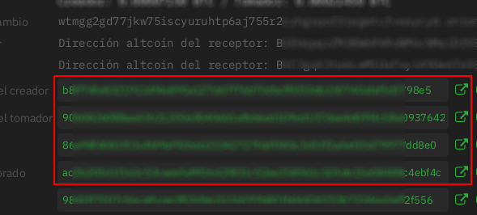
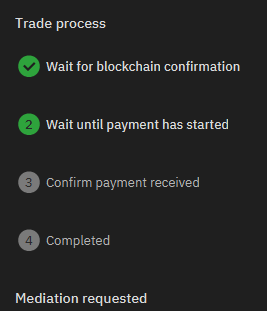

# Known Bugs

1. [Failed trade](#failedTrade)
2. [Unconfirmed Deposit transaction](#unconfirmeddeposittransaction)
3. [BTC seller can't confirm receipt of funds](#btcSellerCantConfirmReceiptOfFunds)

## <a name="failedTrade">Failed trade</a>

A failed trade is a trade where the deposit tx is not valid or submitted and therefore, it’s not possible to complete (the multisig where funds should be locked was not settled correctly).

**How do I know if a trade is failed?**

Click on the little “i” to open trade info.

By searching the maker, taker and deposit tx in a block explorer. If one of these transactions are not found (the most important being the deposit tx), the trade can’t continue and you should submit a trading fee reimbursement 12 if there were trading fee reimbursement (i.e. if you were the maker and maker tx is confirmed).

Click on the arrow symbol at the right side of the red square to be linked to the block explorer.

**I checked on a block explorer and the Deposit tx is confirmed but my Bisq client says that it.**

In this case rely on the block explorer. An [SPV Resync](https://bisq.wiki/Resyncing_SPV_file#From_the_Bisq_interface) should fix the issue on your Bisq client.

**My trade failed, but I still have locked funds.**

If you were i.e. taker and taker tx was invalid, your wallet might be corrupted. A sign for it is that you can’t move the trade to failed and there are funds displayed as locked. If that’s the case, you should not start any more trades, because they will probably fail as well. Disconnect your current open offers until there are no locked funds for this trade. You can finish already opened trades which have a confirmed security deposit. Make sure all other trades are finished an under the `History` tab.

- If the failed trade is still under `Open Trades`, please make a backup, close Bisq. Go to your [Bisq data directory](https://bisq.wiki/Data_directory). And delete the `Bisq/btc_mainnet/db/PendingTrades` file. This will delete the data related to the failed trades and should fix the issue.

- If you were able to move the trade to the `Failed` tab, please make a backup, close Bisq. Go to your [Bisq data directory](https://bisq.wiki/Data_directory). And delete the `Bisq/btc_mainnet/db/FailedTrades` file. This will delete the data related to the failed trades and should fix the issue.

## <a name="unconfirmeddeposittransaction">Unconfirmed Deposit transaction</a>

**I’m waiting for confirmation for too long.**

There’s 2 reasons for that:

- Deposit tx is not confirmed because of “congestion”, meaning that the offered mining fees were too low for current block space market conditions. Your transaction will be waiting until the price for blockchain space is reduced again or nodes forget that tx (as min mining fee chosen by Bisq for trading protocol tx is at least 10 sat, this is not expected).
- Deposit tx is confirmed but Bisq node didn’t detect that: Look for the security deposit tx at an explorer. If it’s confirmed but it’s not shown as it is on your Bisq node, make a [data backup](https://bisq.wiki/Backing_up_application_data) and a [SPV Resync](https://bisq.wiki/Resyncing_SPV_file#From_the_Bisq_interface). That should solve the issue and let you continue with your trade normally. When this happen, the trading chat can be very helpful as you can alert each other about this.

## <a name="btcSellerCantConfirmReceiptOfFunds">BTC seller can't confirm receipt of funds</a>

The BTC buyer clicked `Payment started` and sent the funds to the BTC seller. The BTC seller received the funds but their Bisq client is still on `Step 2 - Wait until payment has started`

Request mediation (ctrl+o), let the Mediator know the issue, fill in the [bug report](bug_report_template.md) and send all requested files to the mediator in a compressed folder.
