# How to create support-*.csv files for reimbursements

### Motivation
This document should help with quick reimbursements for Bisq. A good documentation makes it easy for other people to do the job and maintain the decentralised nature of Bisq this way.

### Disclaimer
The guide expects a unix-like operating system to be used for all commands.

### Setting things up
Clone the repository to your local drive:
`git clone https://github.com/bisq-network/support.git`

Find the issue #number of the batch reimbursement:
1. Go to https://github.com/bisq-network/support/issues
2. filter for label [epic](https://github.com/bisq-network/support/labels/Epic). You will find an open issue with topic: `Batch reimbursement`. Note the issue number (#) as we will use it later.
3. Create the new csv file with the relevant issue number. Let's say the new isue number is #101. You can create the headers for it by using an older support file (#76 in this example) (which already exists in your local cloned repo) like this:

    `head -n 1 support-76.csv > support-101.csv`
    
    You should add the new file now to git:
    
    `git add support-101.csv`
    
    Commit:
    
    `git commit -m "Add batch fee reimbursement CSV file (#101)"`
    
    And push:
    
    `git push`

### Working on issues
Each reimbursement case should have its own issue with text: `Fee reimbursement for trade <trade id>`.

The ones that need to be processed can be found under the [projects -> reimbursement -> Todo](https://github.com/bisq-network/support/projects/1) card.

When you start working on an issue drag it to the `In progress` column, then open it on a new tab. I adwise using a clipboard manager, will be using [copyq](https://hluk.github.io/CopyQ/) here as a reference.

### Working on an issue - an example

We will use #103 as an example here. 
As seen on the [image](https://user-images.githubusercontent.com/301810/39520263-460060c6-4e0a-11e8-886c-9a1bc9d681c4.png) in the issue one of the transactions has a check mark. That one was broadcast to the network. It is a good idea to check the other one on a block explorer, too. Sometimes it happens that both are broadcast, but the deposit address never makes it. Anyway this issue had only the maker transaction on the blockchain, so it means it has to be reimburesed and added to the newly created csv file.

The csv file has these header columns: `gh,transaction,address,tradingfee,miningfee,tradeid`

header|meaning
------|-------
**gh**|this is the github issue number in the example case 103
**transaction**|txid of the transaction to reimburse
**address**|address where to reimburse lost funds
**tradingfee**|the fee paid to the arbitrator
**miningfee**|mining fee of the transaction
**tradeid**|first part of the trade id - referenced in the issue header

The quickest way to do it is as follows (make sure [copyq](https://hluk.github.io/CopyQ/) is running):

1. Highlight the issue number on github and press `ctrl+c` :
    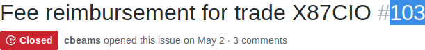
    
2. Highlight the maker txid in the issue page and press `ctrl+c`:
    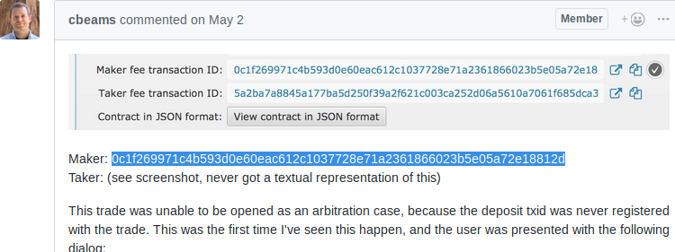
    
3. open a block explorer (showing [bitaps](https://bitaps.com)) and search for the txid from step `2`
   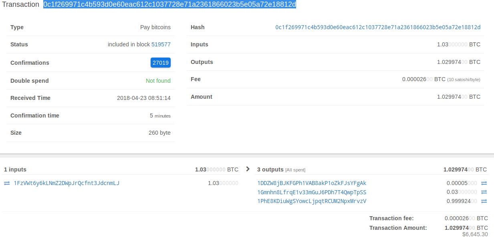
   
4. Highlight the input address and press `ctrl+c`, if there are more pick one. Idealy the user should have provided an address where to reimburse to
    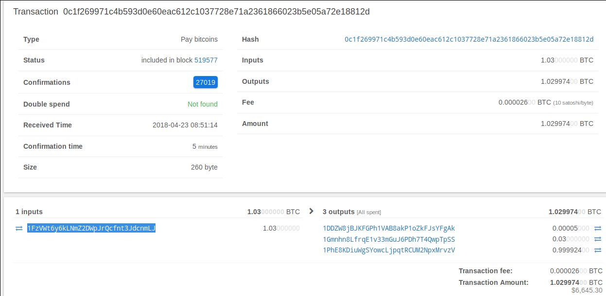
    
5. Highlight the first output addres and press `ctrl+c`. This is the trading fee to the arbitrator.
   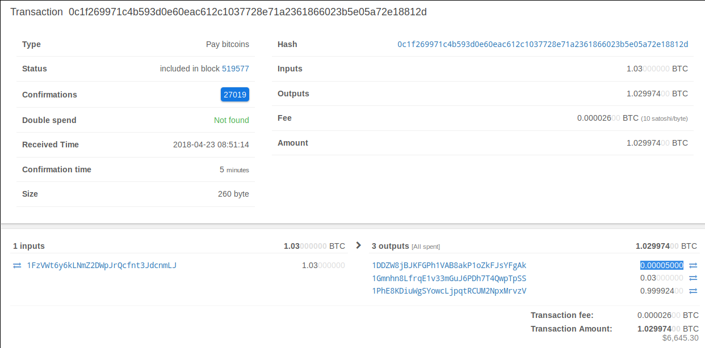
   
6. Highlight the mining fee and press `ctrl+c`
   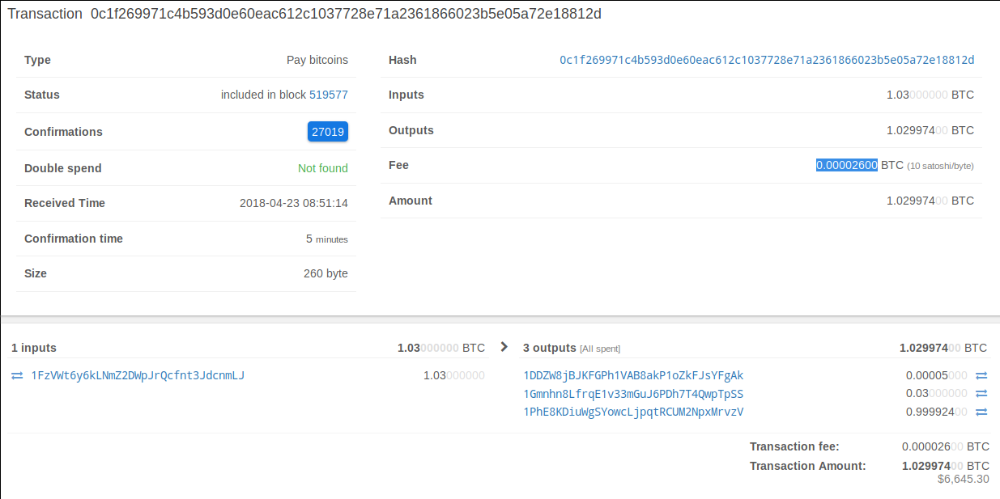
   
7. Highlight the trade id from the issue header and press `ctrl+c`
   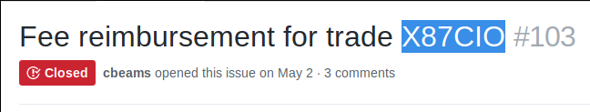
   
If you followed steps 1-7 all the relevant information you need for a line in the csv file is in the clipboard manager. 
    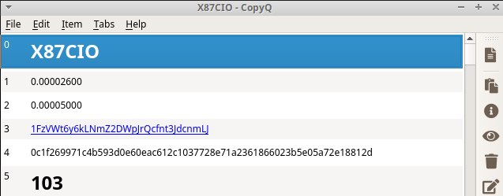

We can use it to our advantage. Open [copyq](https://hluk.github.io/CopyQ/), hold down `shift` and using the `down arrow` key select the last 6 items 
    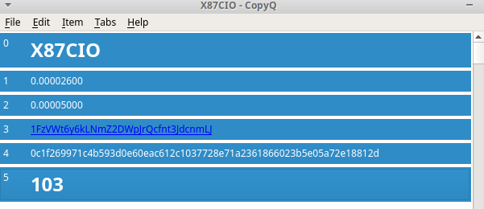

and reverse them (`Edit->Reverse selected items` or press `ctrl+shift+r`).
    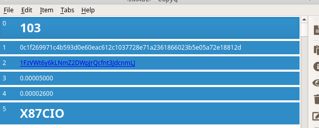

Open the support file in vim:
    `vim support-101.csv`
    
Navigate to the first line, press `o` to start a new line and open [copyq](https://hluk.github.io/CopyQ/). Select the last 6 items and press `enter` to paste them to `vim`. 

    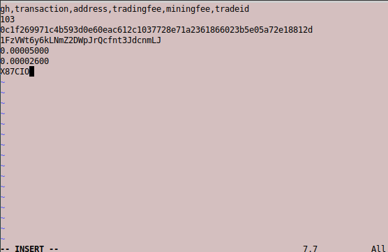

Press `escape` to quit edit mode and navigate the cursor to the line with the github issue (103 in our case). 
    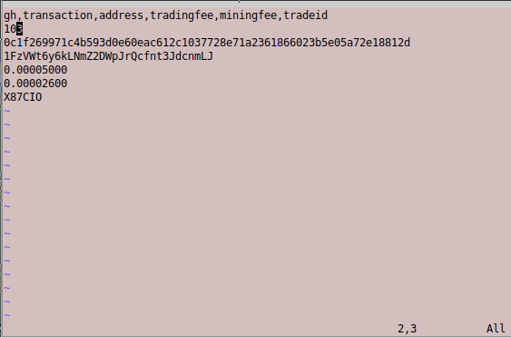

Then press `:` and type in `.,$s/\n/,/`. Make sure the cursor is as described in the above step.
    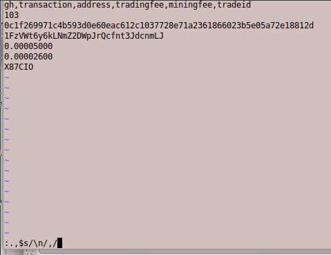

After pressing `enter` all new lines will be replaced with a comma. There is an extra comma at the end which has to be removed. Press `escape` to make sure you are out of edit mode and press `$`. This will jump to the last character of the line. Pressing `x` will remove a character. 

Once done, make sure you are out of edit mode and press `:` then type `wq`. `w` stands for write and `q` for quit. This will save the file and quit vim.

You need to commit the change you have done to the `support-101.csv` file. The commit has to include the issue number you just worked now. In our case #103. Run:

    `git commit -am "Add txns for fee reimbursement #103"
    
And push the changes to the repo:

    `git push`
    
Then drag the card from [projects -> reimbursement -> In progress](https://github.com/bisq-network/support/projects/1) to [Staged](https://github.com/bisq-network/support/projects/1) . The issue should have the steps nicely self documented now, it should look like on the following image:
    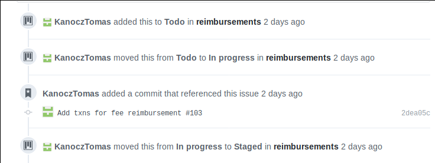

### Lessons learned

- ideally the transaction that is marked with a checkbox should be on the blockexplorer, but the other not (always check if that is the case or not)
- Sometimes you see that maker/taker tansactions are broadcast to the network, but there is still an error. The deposit tx is invalid in those cases(different timestamp + when followed on the block explorer it does not feed to the maker/taker transactions in the ticket)
- sometimes it happens that both maker/taker is published yet there is no deposit transaction. If the trade failed, both have to be reimbursed, meaning there will be 2 lines per trade in the final batch csv
